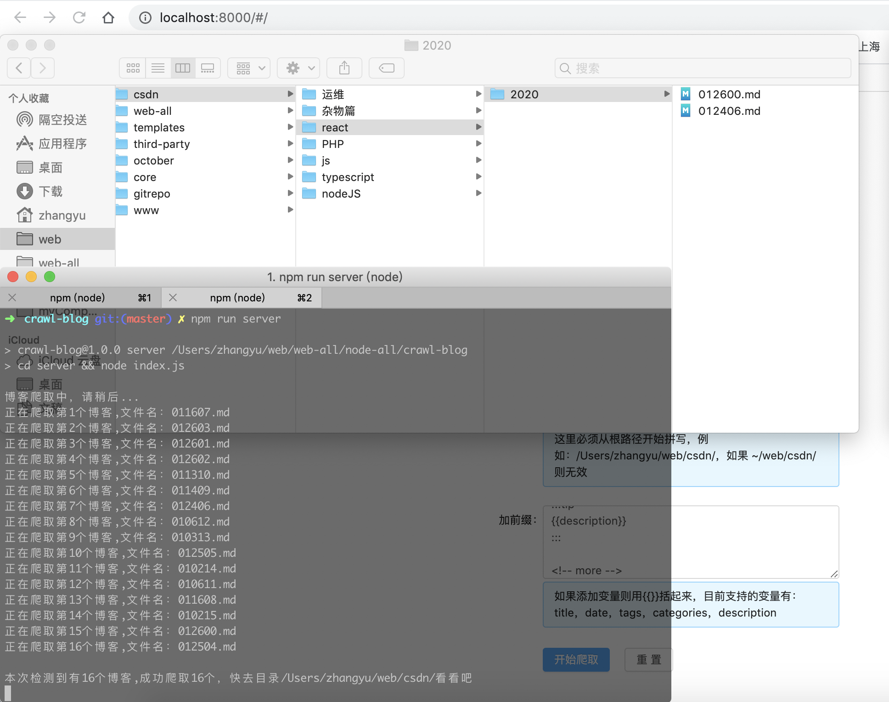

## 简介
一个爬虫小工具，主要用来爬取csdn，博客园，掘金，简书（目前只支持csdn）等等，用来备份或者迁移。



## 适合人群
1. 使用 hexo、vuepress 等等自己搭建的博客，想要从 csdn 迁移过来
2. 想要自己保存一份，害怕哪天 csdn 的服务器爆炸

## 背景
本人一直在 csdn 上写博客，由于 csdn 现在有一些限制，比如不能发表一些技术无关的博客，所以自己用 vuepress 搭建了一个博客，有兴趣可以看一下 [传送门](https://lvan-zhang.github.io/)，但是一个一个的手动迁移的话就会很麻烦，所以最近无聊写一个爬虫解放一下双手。
## 功能
有几个选项可以供你选择：

1. 博客类型
目前只支持 csdn，以后会不定时更新别的
2. 博客id
比如 csdn 的博客域名是这样的 https://blog.csdn.net/weixin_43972437，填上你自己的最后一部分即可
3. 要爬取的月份
csdn 左下角有个归档，可以看到你哪个月写的多少文章，当然如果你不填默认爬取 全部文章
4. cookie
因为爬取 markdown 文件，需要是你是登录的状态，因为正常也是你点击编辑才可以看到 markdown 源文件，而有编辑按钮说明是登录状态，所以这里爬取也需要你登录状态下的cookie。
如何获取 cookie：
登录 csdn，随便选择自己的一篇文章，右键审查元素，点击 network，随便找一个 http 请求点进去，Request Headers 里有个 cookie 复制过来即可
5. 加前缀
一般 hexo 搭建的博客都会需要加前缀，比如我的博客就需要前面加这样一段前缀

```
---
title: 博客名
date: 2020-01-01
tags:
  - node
categories:
  - nodeJS
---

:::tip
这是一个描述
:::

```
那么你也可以自由加，这里还提供几个变量，如果添加变量则用{{}}括起来，目前支持的变量有：title，date，tags，categories，description，比如上面的例子可以这么写

```
---
title: {{title}}
date: {{date}}
tags:
  - {{categories}}
categories:
  - {{categories}}
---

:::tip
{{description}}
:::

```
## 用到的技术
前端技术：react + antd + dva
后端技术：node + express + 一些爬虫插件
## 如何使用
由于资金有限，目前没有部署到服务器，只能本地运行。

先把项目 clone 到本地，我使用的 node 版本为 12.10.0

后端：

```
cd server
npm install
node index.js
```
前端：

```
cd client
npm install
npm start（这一步就可以看到前端页面了）
```
然后在页面上输入你的配置就可以爬取啦~~
## 后记
实现的比较匆忙，代码有很多地方还需要优化，不过功能是可以实现的啦，有需要的同学可以用一下试试，觉得有用就
# 点个 star 哦~
# 个star哦~
# star哦~
# 哦~
# ~